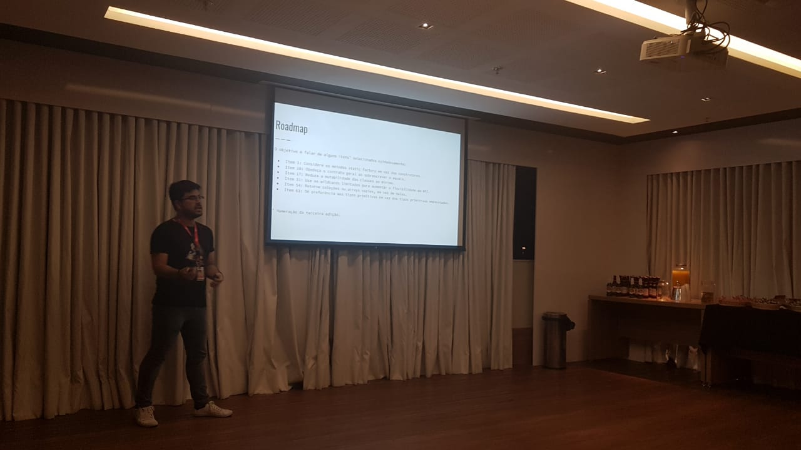

# Movile/RSJUG Meetup - Java Efetivo para quem tem pressa

**Data**: 2019-06-25  
**Local**: Escritório do iFood em Porto Alegre

Link da apresentação: [Java Efetivo para quem tem pressa](https://drive.google.com/open?id=1Rto_o8jIA8BAjkTKgC6jxA7U_0TMdvAI).

---

Olá, galera.

Nesta última terça-feira foi dia de falar sobre Java efetivo na primeira edição
da Movile Meetup em parceria com o [RSJUG](https://rsjug.github.io/site/).
O meetup foi realizado no espaço de eventos da Flowork, onde se localiza
atualmente o hub de desenvolvimento da Movile (iFood, Wavy etc) em Porto Alegre.

Apesar da chuva, tudo correu super bem e foi muito produtivo para conhecer
novas pessoas e contribuir um pouco com a comunidade.

A ideia dessa apresentação foi falar um pouco sobre as ótimas dicas do livro
[Java Efetivo de Joshua Bloch](https://www.amazon.com.br/Effective-Java-3rd-Joshua-Bloch/dp/0134685997).
Obviamente, não teria tempo (e ninguém teria a paciência) de falar sobre todos
79 itens da 3ª edição, então selecionei 6 itens que achei mais interessantes.
A intenção foi instigar as pessoas a conhecerem o livro e buscarem mais esse
tipo de literatura, sempre tão válida para nós desenvolvedores.

O meetup também contou com a participação de [Marcelo Adamatti](https://adamatti.github.io)
falando sobre desenvolvimento de microsserviços utilizando Micronaut e de
outros ótimos palestrantes trazidos pelo RSJUG.
