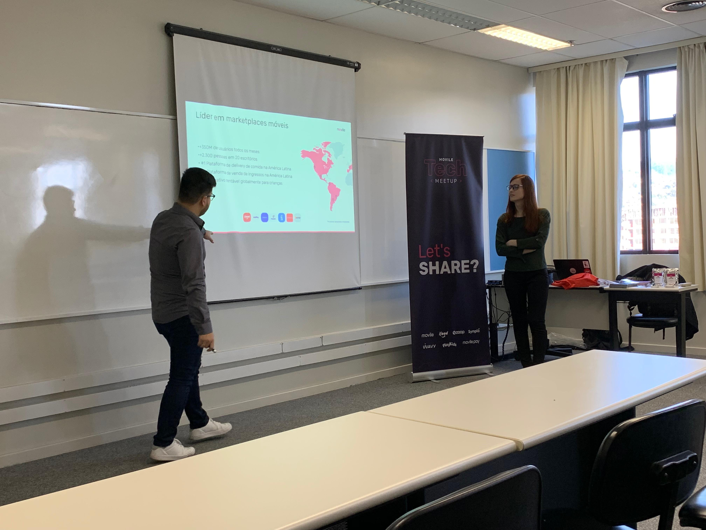

# Movile Mobile Dream

**Data**: 2019-08-28  
**Local**: PUCRS

Olá, galera.

Esta última quarta-feira foi a vez de chamar o pessoal da PUCRS para participar
de mais uma edição do Mobile Dream.

Eu e a [Sara Lacerda](https://www.linkedin.com/in/sarahlacerdacc/), da Wavy,
fomos até a PUCRS para falar um pouquinho sobre a Movile, sobre a nossa
vivência dentro das empresas do grupo, e ajudar o pessoal a tirar dúvidas
sobre o programa.

O Mobile Dream é composto na verdade de dois programas, um para estágio e
outro pra trainee. Como todos presentes eram graduandos, demos ênfase ao
programa de estágio e sanamos várias dúvidas sobre como é trabalhar e
estudar ao mesmo tempo, e como isso ajuda a nos desenvolver.
