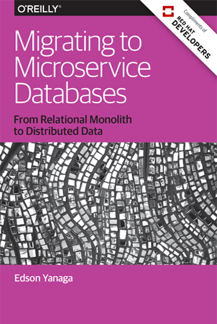

# Migrating to Microservice Databases

* **Título**: Migrating to Microservice Databases - From Relational Monolith to Distributed Data
* **Autor**: Edson Yanaga
* **Editora**: O'Reilly
* **Ano**: 2017 (1ª edição)
* **Páginas**: 60

## Review

Essa é a primeira review que escrevo sobre livros que estou lendo ou já li inteiros. A ideia é passar as minhas impressões e tentar ajudar a guiar quem está buscando a próxima leitura e, assim como eu, recorre a comentários de quem já teve a oportunidade de folhear o material.

Começo então com um livro que já li por completo. O meu piloto é o *Migrating to Microservice Databases* escrito pelo Java Champion brasileiro [Edson Yanaga](https://yanaga.io/). Esse é um livro curtinho (60 pg.) que ganhei (sim, ganhei, :)) durante a trilha de Go no TDC Porto Alegre 2019.

O livro, que conta com 5 capítulos, aborda um assunto (entre outros) muitas vezes negligenciado, mas que incomoda muita gente: migração de banco de dados. O tema é tratado com muito pé no chão e de forma pragmática.

Nos dois primeiros capítulos, são introduzidos conceitos que para muitos já são familiares como DevOps, microsserviços, DDD e estratégias de deployment que visam zero-downtime. Apesar de serem apresentados de forma bastante sucinta (~1 pág. para cada um desses conceitos), o Edson tem sucesso em passar as ideias essenciais, realmente o core, por trás de cada um desses conceitos. Talvez o fato de ser super direto ao ponto também pode ser uma das suas maiores forças: há praticamente nenhum desperdício com texto prolixo e o leitor tem conteúdo relevante por toda extensão do livro.

Dado contexto e tendo o leitor recapitulado algumas definições, o terceiro capítulo trata das migrações de maneira bastante prática. Essa seção tem um toque de guia/referêcia em como realizar migrações seguras e com zero-downtime em bancos relacionais. São mostradas estratégias para a realização de quatro atividades cotidianas - adição de coluna, renomeação de coluna, alteração de tipo de dados de uma coluna e deleção de coluna. O objetivo do capítulo é mostrar como realizar essas ações de forma responsável, cautelosa e com baixo ou nenhum impacto em produção.

No quarto capítulo, são discutidos dois padrões de acesso e manipulação de dados - CRUD e CQRS. O primeiro já deve ser bastante familiar para a maioria dos desenvolvedores e é apresentado de forma rápida. Já CQRS pode ser novo ou pouco familiar para muitos de nós. Particularmente gostei bastante da apresentação sobre CQRS. Obviamente o espaço dedicado é muito curto para uma abordagem extensiva, mas serviu como uma competente introdução e como faísca para me aprofundar mais. Event sourcing também é apresentado como um padrão adicional na  modelagem dos dados, trazendo novas features como replay de eventos e consequemente auditoria.

O livro fecha com um capítulo sobre estratégias de integração. Se antes tínhamos um único serviço monolítico e (provavelmente) um único banco de dados, agora com microsserviços teremos potencialmente vários bancos de dados. Como realizamos a evolução dos dados antes centralizados para uma versão distribuída? E ainda, como integramos microsserviços em torno desses dados? Estas são algumas perguntas que tentam ser respondidas nesse último capítulo.

Como dito, o livro é extremamente curto, mas sua concisão também o torna uma excelente leitura. Tudo é apresentado de forma bastante direta e pragmática, o que o torna ideal como uma introdução rápida aos temas. Certamente não reclamaria se o livro tivesse algumas páginas a mais para aprofundar em assuntos como estratégias de deploy e CQRS. Fico imaginando como seria um livro ainda mais abrangente e detalhado escrito pelo Edson Yanaga. Quem sabe!

Espero que essa breve review tenha ajudado a revelar um pouco do que o livro guarda!
